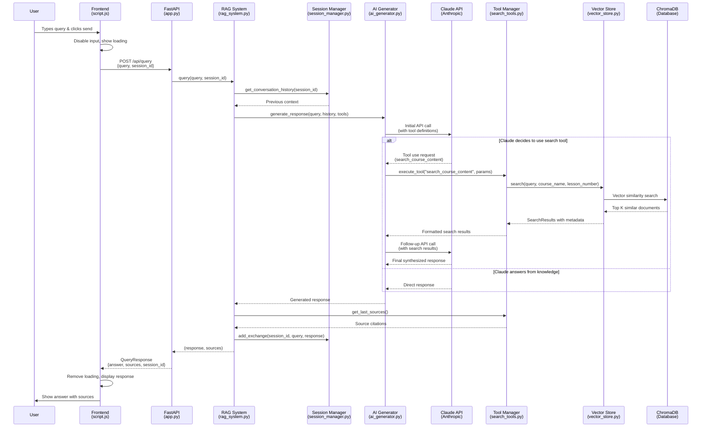
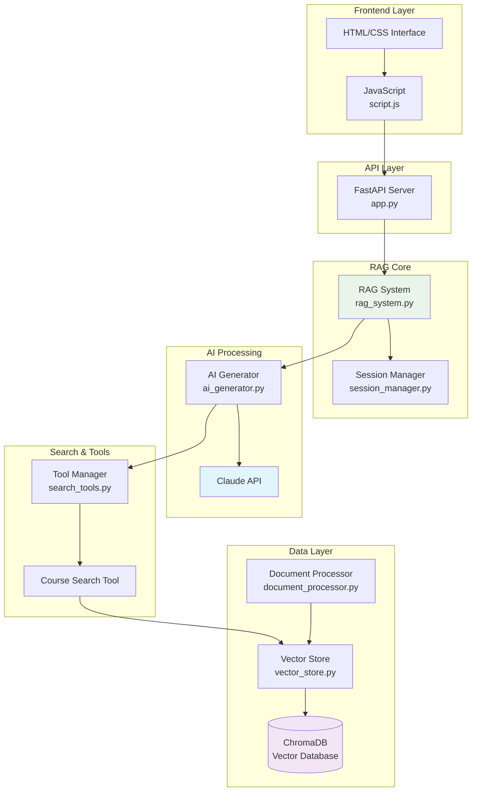
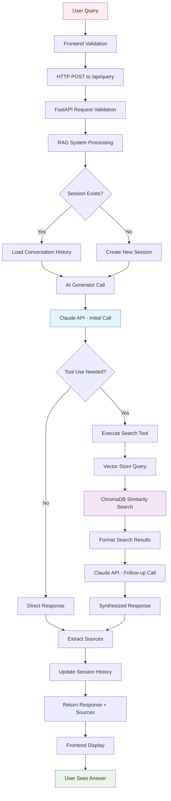

# RAG System Query Processing Flow

```mermaid
sequenceDiagram
    participant User
    participant Frontend as Frontend<br/>(script.js)
    participant FastAPI as FastAPI<br/>(app.py)
    participant RAGSystem as RAG System<br/>(rag_system.py)
    participant SessionMgr as Session Manager<br/>(session_manager.py)
    participant AIGen as AI Generator<br/>(ai_generator.py)
    participant Claude as Claude API<br/>(Anthropic)
    participant ToolMgr as Tool Manager<br/>(search_tools.py)
    participant VectorStore as Vector Store<br/>(vector_store.py)
    participant ChromaDB as ChromaDB<br/>(Database)

    User->>Frontend: Types query & clicks send
    Frontend->>Frontend: Disable input, show loading
    Frontend->>FastAPI: POST /api/query<br/>{query, session_id}
    
    FastAPI->>RAGSystem: query(query, session_id)
    
    RAGSystem->>SessionMgr: get_conversation_history(session_id)
    SessionMgr-->>RAGSystem: Previous context
    
    RAGSystem->>AIGen: generate_response(query, history, tools)
    
    AIGen->>Claude: Initial API call<br/>(with tool definitions)
    
    alt Claude decides to use search tool
        Claude-->>AIGen: Tool use request<br/>(search_course_content)
        
        AIGen->>ToolMgr: execute_tool("search_course_content", params)
        ToolMgr->>VectorStore: search(query, course_name, lesson_number)
        VectorStore->>ChromaDB: Vector similarity search
        ChromaDB-->>VectorStore: Top K similar documents
        VectorStore-->>ToolMgr: SearchResults with metadata
        ToolMgr-->>AIGen: Formatted search results
        
        AIGen->>Claude: Follow-up API call<br/>(with search results)
        Claude-->>AIGen: Final synthesized response
    else Claude answers from knowledge
        Claude-->>AIGen: Direct response
    end
    
    AIGen-->>RAGSystem: Generated response
    
    RAGSystem->>ToolMgr: get_last_sources()
    ToolMgr-->>RAGSystem: Source citations
    
    RAGSystem->>SessionMgr: add_exchange(session_id, query, response)
    
    RAGSystem-->>FastAPI: (response, sources)
    FastAPI-->>Frontend: QueryResponse<br/>{answer, sources, session_id}
    
    Frontend->>Frontend: Remove loading, display response
    Frontend->>User: Show answer with sources
```

## Component Architecture

```mermaid
graph TB
    subgraph "Frontend Layer"
        UI[HTML/CSS Interface]
        JS[JavaScript<br/>script.js]
    end
    
    subgraph "API Layer"
        FastAPI[FastAPI Server<br/>app.py]
    end
    
    subgraph "RAG Core"
        RAG[RAG System<br/>rag_system.py]
        Session[Session Manager<br/>session_manager.py]
    end
    
    subgraph "AI Processing"
        AIGen[AI Generator<br/>ai_generator.py]
        Claude[Claude API]
    end
    
    subgraph "Search & Tools"
        ToolMgr[Tool Manager<br/>search_tools.py]
        SearchTool[Course Search Tool]
    end
    
    subgraph "Data Layer"
        VectorStore[Vector Store<br/>vector_store.py]
        ChromaDB[(ChromaDB<br/>Vector Database)]
        DocProcessor[Document Processor<br/>document_processor.py]
    end
    
    UI --> JS
    JS --> FastAPI
    FastAPI --> RAG
    RAG --> Session
    RAG --> AIGen
    AIGen --> Claude
    AIGen --> ToolMgr
    ToolMgr --> SearchTool
    SearchTool --> VectorStore
    VectorStore --> ChromaDB
    DocProcessor --> VectorStore
    
    style Claude fill:#e1f5fe
    style ChromaDB fill:#f3e5f5
    style RAG fill:#e8f5e8
```

## Data Flow Detail

```mermaid
flowchart TD
    A[User Query] --> B[Frontend Validation]
    B --> C[HTTP POST to /api/query]
    C --> D[FastAPI Request Validation]
    D --> E[RAG System Processing]
    
    E --> F{Session Exists?}
    F -->|Yes| G[Load Conversation History]
    F -->|No| H[Create New Session]
    G --> I[AI Generator Call]
    H --> I
    
    I --> J[Claude API - Initial Call]
    J --> K{Tool Use Needed?}
    
    K -->|No| L[Direct Response]
    K -->|Yes| M[Execute Search Tool]
    
    M --> N[Vector Store Query]
    N --> O[ChromaDB Similarity Search]
    O --> P[Format Search Results]
    P --> Q[Claude API - Follow-up Call]
    Q --> R[Synthesized Response]
    
    L --> S[Extract Sources]
    R --> S
    S --> T[Update Session History]
    T --> U[Return Response + Sources]
    U --> V[Frontend Display]
    V --> W[User Sees Answer]
    
    style A fill:#ffebee
    style W fill:#e8f5e8
    style J fill:#e1f5fe
    style O fill:#f3e5f5
```